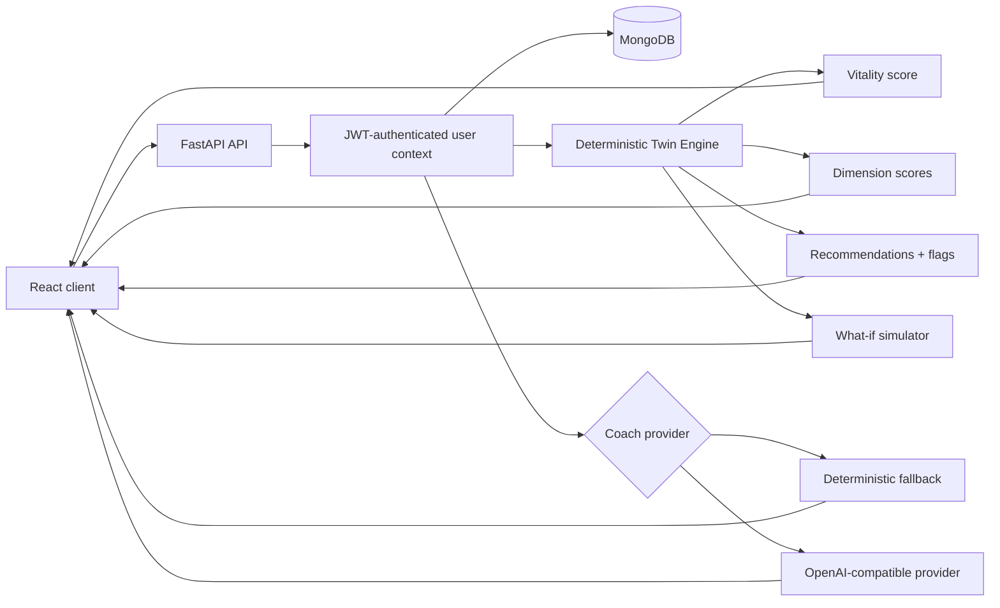

# VitaTwin

Explainable personal-wellness digital twin built as an AI engineering portfolio MVP.


VitaTwin turns a health baseline and short daily check-ins into transparent wellness scores, trends, attention flags, recommendations, and what-if simulations. An optional contextual AI coach can explain recorded patterns, while the core scoring and simulation logic remains deterministic and inspectable.

> Portfolio status: functional MVP and general-wellness tool. VitaTwin is not a medical device, does not diagnose conditions, and is not intended for emergencies.

## Core product flow

1. Create an account and establish a wellness baseline.
2. Record a short daily check-in covering sleep, stress, movement, hydration, mood, and optional resting heart rate.
3. Review the overall vitality score and six visible dimensions: sleep, activity, recovery, mood, lifestyle, and body.
4. Inspect fourteen-day trends, recommendations, and plainly worded attention flags.
5. Use the what-if lab to see how the deterministic wellness model responds to lifestyle changes.
6. Ask the AI coach questions about recorded patterns, with a safe deterministic fallback when no AI provider is configured.

## Why this project is useful in an AI engineering portfolio

VitaTwin is designed to show a different AI architecture from a typical chatbot:

- **Explainability-first design:** the central score is calculated by deterministic domain rules rather than hidden LLM reasoning.
- **Separation of concerns:** AI augments explanation and coaching, but the product still works without an AI key.
- **What-if simulation:** users can alter inputs and compare the model's before/after response without claiming medical prediction.
- **Context-aware AI:** the coach receives the user's recorded wellness context instead of answering as a generic assistant.
- **Reliable data model:** unique email and per-user daily-check-in constraints prevent duplicate baseline records.
- **Security:** bcrypt password hashing, expiring JWT access tokens, and authenticated user-scoped data.
- **Verification:** integration tests, dedicated twin-engine tests, frontend checks, production builds, Docker, and GitHub Actions CI.

## MVP capabilities

- Email/password registration and login with bcrypt password hashing and expiring JWT access.
- Health baseline covering age, height, weight, smoking, alcohol, goals, and optional known conditions.
- One idempotent daily check-in per user/date with mood, stress, sleep, movement, hydration, resting heart rate, and notes.
- Explainable vitality score with six visible dimensions.
- Fourteen-day trend, check-in streak, ranked recommendations, and attention flags.
- What-if simulator for changed sleep, activity, stress, smoking, and related lifestyle inputs.
- Context-aware wellness coach with deterministic fallback when no AI key is configured.
- Responsive React interface.
- Dockerized frontend/API/database setup and CI verification.

## Architecture



A deliberate design choice is that the LLM is never the source of truth for the core wellness score. That keeps the central product behaviour deterministic, testable, and explainable.

For deeper design notes, see [`docs/ARCHITECTURE.md`](docs/ARCHITECTURE.md).

## User experience

The frontend exposes five primary areas:

- **Overview** — today's vitality score, dimension breakdown, trends, recommendations, and attention flags.
- **Daily check-in** — a short structured form for recording daily signals.
- **What-if lab** — scenario modelling with before/after scores and an explanation of the delta.
- **AI coach** — contextual questions about recorded patterns with explicit wellness boundaries.
- **Health profile** — editable baseline data that feeds the deterministic twin engine.

## Technology

| Layer | Technology |
| --- | --- |
| Frontend | React 18, Vite, Axios, Lucide icons, responsive CSS |
| API | FastAPI, Pydantic |
| Authentication | bcrypt password hashing, JWT access tokens |
| Data | MongoDB |
| Core reasoning | Deterministic twin engine |
| Optional AI | OpenAI-compatible chat-completions provider |
| Packaging | Docker, Docker Compose, Nginx |
| Quality | Pytest, frontend checks/build, GitHub Actions |

## Run locally

Docker is the shortest path:

```bash
cp .env.example .env
docker compose up --build
```

Open `http://localhost:8080`. FastAPI documentation is available at `http://localhost:8000/docs`.

The application works without an AI key. Add `OPENAI_API_KEY` to `.env` only if you want provider-generated coach responses.

## Development

```bash
# API
python -m venv .venv
source .venv/bin/activate
pip install -r backend/requirements.txt pytest
MONGODB_URI=mongodb://localhost:27017 DATABASE_NAME=vitatwin_dev \
  JWT_SECRET=local-development-secret-change-me \
  uvicorn main:app --app-dir backend --reload

# Frontend
cd frontend
npm ci
npm run dev
```

## API surface

- `POST /api/v1/auth/register`
- `POST /api/v1/auth/login`
- `GET /api/v1/auth/me`
- `GET|PUT /api/v1/profile`
- `GET|POST /api/v1/checkins`
- `GET /api/v1/twin/dashboard`
- `POST /api/v1/twin/simulate`
- `POST /api/v1/twin/coach`
- `GET /health`
- `GET /ready`

## Verification

```bash
pytest -q backend/tests
cd frontend
npm run check
npm run build
```

The backend suite includes API integration coverage and dedicated tests for the deterministic twin engine. Integration tests use a disposable MongoDB database; never point the test suite at production.

## Design boundaries

VitaTwin intentionally avoids presenting wellness scores as diagnosis or prognosis. The what-if lab shows how the application's own transparent rules react to changed inputs; it does not forecast disease, lifespan, or treatment outcomes. The AI coach is a contextual wellness interface, not a clinician.
