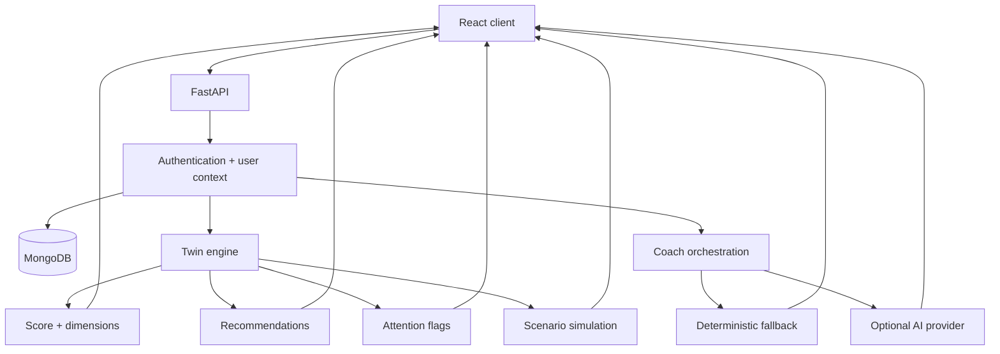

# VitaTwin architecture

This document explains the architecture and design decisions behind the VitaTwin portfolio MVP.

## Design principle

VitaTwin separates **deterministic wellness reasoning** from **generative AI assistance**.

The core vitality score, its dimension breakdown, recommendations, flags, and what-if comparisons are produced by explicit application logic. The optional AI coach can help explain patterns, but it does not control the source-of-truth score.

This separation makes the system easier to test, explain, and reason about.

## High-level architecture



## Data model and user isolation

Each authenticated user has a private wellness workspace.

The backend stores:

- account identity and authentication data;
- health-profile baseline inputs;
- daily check-ins;
- the data needed to calculate current and historical wellness views.

MongoDB indexes enforce unique user email addresses and one check-in per user/date. This gives the daily check-in endpoint idempotent product behaviour at the data layer rather than relying only on frontend discipline.

## Twin engine

The deterministic twin engine is responsible for translating recorded signals into application-level wellness outputs.

It produces:

- an overall vitality score;
- six visible dimensions: sleep, activity, recovery, mood, lifestyle, and body;
- ranked recommendations;
- attention flags;
- before/after results for the what-if simulator.

The important architecture choice is that these values are generated from inspectable rules. An LLM cannot silently change the score or invent its own scoring method.

## What-if simulation

The simulator copies the user's current context, applies proposed lifestyle changes to the scenario input, and re-runs the deterministic engine.

This allows the UI to show:

```text
current inputs -> current score
changed inputs -> simulated score
                    |
                    -> delta + explanation
```

The result is a model-behaviour comparison, not a medical forecast.

## AI coach

The coach sits on top of the recorded wellness context.

When an AI provider is configured, the application can use that provider to generate a contextual response. When no key is configured, VitaTwin falls back to deterministic guidance so the core product remains usable and demonstrable.

This provider boundary has three benefits:

1. the product can run without external AI dependencies;
2. provider outages do not remove the core dashboard/simulation functionality;
3. AI-generated explanations remain separate from the deterministic source of truth.

## Authentication and security

The MVP uses:

- bcrypt password hashing;
- expiring JWT access tokens;
- authenticated user-scoped API access;
- backend-only environment variables for secrets and optional AI credentials.

For a larger production system, logical next steps would include refresh-token rotation, account recovery, stronger audit logging, rate limits, and a managed secrets service.

## Frontend structure

The React UI is organised around five product areas:

- Overview
- Daily check-in
- What-if lab
- AI coach
- Health profile

The application deliberately exposes the score's component dimensions instead of presenting one unexplained number. That makes the UI reinforce the same explainability principle as the backend.

## Reliability and verification

The repository includes:

- API integration tests;
- dedicated tests for the twin engine;
- frontend verification/build commands;
- health and readiness endpoints;
- Docker images for the API and frontend;
- Docker Compose for repeatable local setup;
- GitHub Actions CI.

## Production evolution

A production version could evolve toward:

```text
React app
   |
API gateway / TLS
   |
FastAPI services
   |---- Auth / account service
   |---- Twin calculation service
   |---- Coach service
   |
MongoDB / managed database
   |
Observability + audit + secrets management
```

The current MVP keeps these responsibilities in a compact codebase so the architecture remains easy to inspect in a portfolio setting.

## What this architecture demonstrates

VitaTwin is intended to demonstrate practical experience with:

- explainable AI-system design;
- deterministic reasoning alongside generative AI;
- contextual AI integration;
- FastAPI and Pydantic services;
- MongoDB persistence and data constraints;
- authentication and user-scoped data;
- scenario simulation;
- Dockerized full-stack delivery;
- automated integration testing and CI.
